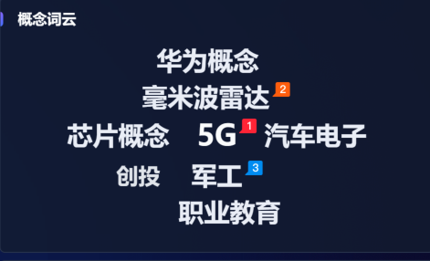

# 武汉凡谷电子技术股份有限公司（002194）调研简报

> 截止数据：2024 年报 & 2024 Q1

---

## 公司概况

| 要素 | 详情 |
|------|------|
| 成立 / 上市 | 1989 年成立，2007 年深交所上市 |
| 注册地 | 武汉市东湖高新区 |
| 主营业务 | 射频滤波器 / 双工器、塔顶放大器（TMA）、射频子系统、微波天线 |
| 市场地位 | 国内基站滤波器核心厂商，全球主流系统设备商（华为、中兴、爱立信等）合格供应商 |
| 实际控制人 | 王丽丽（27.9 %）、孟庆南（7.4 %）——夫妻档控股 |

---

## 产品与技术布局

### 核心产品

- **腔体滤波器**：大功率、4 G/5 G 宏站主力器件  
- **陶瓷 / 介质滤波器**：小型化、低插损；5 G Massive-MIMO 需求快速增长  
- **射频子系统**：RRH 前端、合路器、塔放（TMA）  
- **微波天线**：微波回传、E-Band 波导部件  

### 研发方向

- 7 GHz 以下介质滤波器、毫米波波导器件  
- 6 G 高频天线、ARFT（有源射频前端）  
- 2024 年研发费用 **1.35 亿元**，占营收 **9.1 %**

---

## 财务表现

### 2024 财年

| 指标 | 数值 | YoY | 备注 |
|------|------|-----|------|
| 营业收入 | **14.82 亿元** | −6.6 % | 内销 −6 %，外销 −7.4 % |
| 归母净利润 | **0.53 亿元** | −36.7 % | 行业 CAPEX 低迷 |
| 毛利率 | 23.6 % | +1.1 pp | 陶瓷滤波器占比提升 |
| 经营现金流 | 0.08 亿元 | −97 % | 采购付款节点错配 |

### 2023 财年回顾

- 营收 **15.88 亿元**，归母净利 **0.84 亿元**  
- 毛利率 **22.5 %**，ROE **3.22 %**

### 2024 Q1 概况

- 营收 **3.03 亿元**（−39 %）  
- 归母净利 **0.026 亿元**（−94 %）

---

## 资产负债与现金流（2024/12/31）

| 项目 | 数值 | 同比 |
|------|------|------|
| 资产总额 | 30.75 亿元 | −0.1 % |
| 货币资金 | 5.02 亿元 | −6.5 % |
| 有息负债 | 1.46 亿元 | −30 % |
| 资产负债率 | 17.7 % | −1.3 pp |

> 低负债 + 充裕现金，为产线升级和研发提供安全边际。

---

## 股东结构与治理

- 控股家族合计持股约 **43 %**，控制权稳固  
- 深股通持股约 **1.8 %**  
- 前五大客户销售占比 ≈ **60 %** —— 客户集中度偏高

---

## 行业环境与风险

| 机遇 | 风险 |
|------|------|
| 5 G-A / 6 G 高频滤波器升级需求 | 全球 RAN 投资持续下滑，行业周期底部未明 |
| 海外替换市场（中东、拉美） | 汇率波动、贸易壁垒 |
| 自动化产线降本提效 | 新技术（硅光、有源阵列）潜在替代 |

---

## 未来战略

1. **产品升级**：量产小型化介质 / 陶瓷滤波器，预研毫米波波导技术  
2. **市场多元**：深耕新兴海外市场，降低单一运营商依赖  
3. **智能制造**：数字化生产线，目标 2026 年毛利率提升至 **27 %**

---

## 结论

武汉凡谷在射频滤波器领域拥有深厚技术与客户基础，财务结构稳健，但短期业绩随运营商 CAPEX 周期波动。公司正通过高研发投入与自动化降本，力争在 5 G-A/6 G 周期迎来盈利拐点。投资者需关注行业景气度、产能利用率及新产品放量进度。

# 概念

# 买卖记录

### 250424

